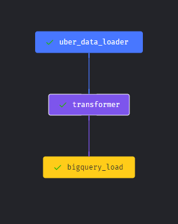

# Uber-Data-Pipeline

I use this project to help myself go through modern data engineering technologies, including GCP Storage, Compute Instance, Mage Data Pipeline Tool and BigQuery.

You can have an overview of the pipeline below, and this note will guide you step by step understanding what this project is doing.

 

## 1. Dataset

TLC Trip Record Data Yellow and green taxi trip records include fields capturing pick-up and drop-off dates/times, pick-up and drop-off locations, trip distances, itemized fares, rate types, payment types, and driver-reported passenger counts.

The data can be found here: https://www.nyc.gov/site/tlc/about/tlc-trip-record-data.page

And this is the data dictionary that will help you understand these data: https://www.nyc.gov/assets/tlc/downloads/pdf/data_dictionary_trip_records_yellow.pdf

 

## 2. Data Model

The original dataset contains many columns so it is a bit confusing when first look at it. Also, in practice, we don't need every columns when we want to analyse it. That's why I want to build a data model to help me get a high level understanding of these data cols and the relationship between them.

 

## 3. Data Storage - Google Cloud Storage

I use Google Cloud Storage to store the data online, and allow public access. So you can check the data using this link: https://storage.googleapis.com/uber-data-pipeline-jinze/uber_data.csv.

 

## 4. Mage VM Set Up

I create a virtual machine instance using Google Compute Engine, install python environment as well as packages(pandas, mage, ...) on that. Then I run mage on that VM at port 6789, and allowed public access at that port, so
you can access that VM instance using its IP address and port(http://34.125.81.68:6789/).

